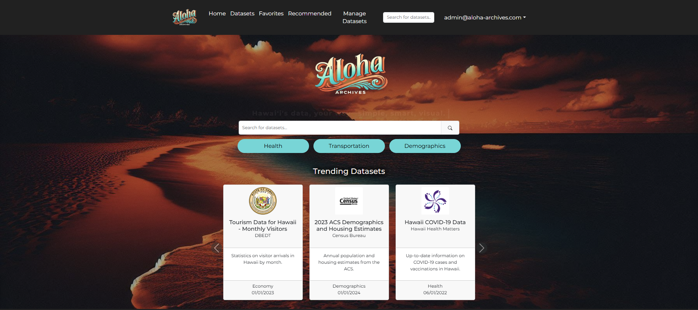
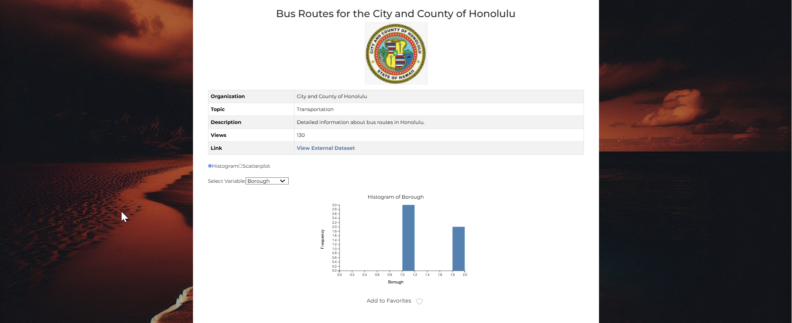
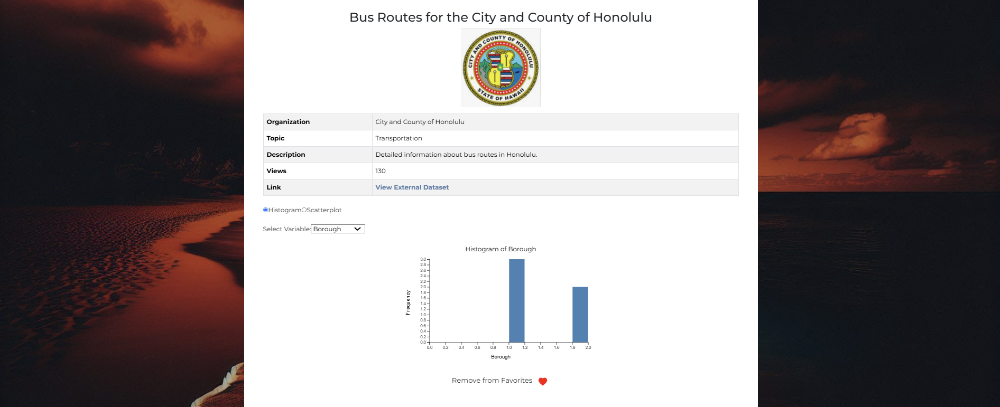

# Project Summary

The **Aloha Archives** project reimagines Hawai’i’s Open Data Portal, addressing its limitations with an accessible, user-friendly, and visually engaging platform that empowers citizens and policymakers to explore and utilize government datasets effectively. By transforming Hawai’i’s Open Data Portal into an engaging and accessible tool, Aloha Archives advances the state’s goal of increasing transparency and fostering civic engagement.

## The Problem

The current Hawai’i Open Data Portal has several usability challenges:

1. **Limited Accessibility**: Data is available only in raw formats, making it difficult for non-technical users to engage.
2. **Lack of Visualizations**: Users struggle to interpret data due to the absence of interactive visual tools.
3. **Inconsistent Organization**: Variability in how datasets are grouped and tagged reduces discoverability.
4. **Static User Experience**: The interface does not cater to varying levels of digital literacy or adapt to user preferences.

## The Solution

Aloha Archives addresses these challenges through:

1. **Search and Results Optimization**:  
   - A dynamic search bar integrates user queries with URL parameters, allowing for advanced filtering by topic, organization, and sorting criteria. It supports real-time updates and intuitive navigation to the results page.  
   - The results page features robust filtering, sorting, and topic-based exploration, ensuring users can quickly find relevant datasets.

2. **Persona-Based Recommendations**:  
   - Users can take a short quiz to identify their “persona,” which provides personalized dataset suggestions tailored to their interests.

3. **Interactive Visualizations**:  
   - Data insights are presented using visual tools, making information accessible to users of all technical backgrounds.

4. **Admin Management**:  
   - Administrators can manage datasets through features for adding, editing, and deleting data while maintaining integrity.

5. **Accessibility**:  
   - Designed with universal design principles to accommodate users with diverse digital literacy levels.

## My Contrubutions

1. **General Styling**:
    - The background had been formatted twice, once with a shack on the beach to a darker contrasted beach to allow users to see the website as clearly as possible.
    - For the color, I chose red and black since its my favorite color scheme and I believe it to be a pleasing combination to the eyes.

2. **Favorite Datasets Functionality**:
    - Users are given the option to add to a list their favorite datasets for later viewing upon returning to the site. This is marked by a heart React component that is filled out and is updated to the site when viewing different pages.
    - The Favorite Datasets page itself is updated to list all favorited datasets properly.

 

3. **Trending Datasets with Carousel**
    - Users on the home page see a 3 dataset card carousel move on a timer the Datasets which have been viewed the most on the site.
    - On it are the name of the dataset, a short description, its category, and the number of views the dataset has. The view count determined whether the card is added or removed from the carousel.

    

